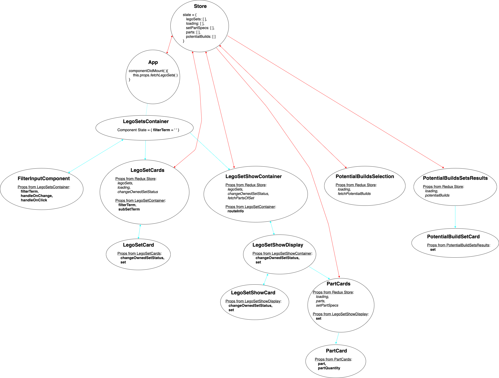

# My Bricks App


## Purpose and Usage

If you are a lover of Lego, you may have found yourself wondering:
`"What other Lego sets could I build with the ones I already own?" `
With this App, you can answer that question.

Search the database for Lego sets by name, theme, and set-number. Add sets to your collection. Find out what you can build with what you have.

See this [demo](https://youtu.be/45j-xHOpQgM) on the app's features.

As proof of concept, I harvested close to 740 Lego sets from the [Rebrickable Api](https://rebrickable.com/api/v3/docs/) and persisted the data along with the Lego sets' parts to the backend of this application—[My-Bricks-App-Backend](https://github.com/DavidRMorphew/my-bricks-app-backend). But, you could add all of nearly 18,000 sets in the Rebrickable Api database into the backend to expand your searches using the seeds file. See the [README](https://github.com/DavidRMorphew/my-bricks-app-backend/blob/main/README.md) instructions in the My-Bricks-App-Backend for more on seeding the data into the database.

## Installation
To install the program, open your terminal and run the following command:

```
git clone git@github.com:DavidRMorphew/my-bricks-app-frontend.git
```

Also be sure to fork and clone the [My-Bricks-App-Backend](https://github.com/DavidRMorphew/my-bricks-app-backend) repo in order to run the app. Follow the [instructions](https://github.com/DavidRMorphew/my-bricks-app-backend/blob/main/README.md) on installing and running the backend and them come back here.

## Starting the App

First install and start the My-Bricks-App-Backend server. (See the end of the last section). After beginning the backend server, open this frontend of the app:

```
cd my-bricks-app-frontend
```
Run
```
npm install
```
You may also need to make these additional installations:
```
npm install redux && npm install react-redux
npm install --save redux-thunk
npm install --save react-router-dom
```

To start the app:
```
npm start
```

Now you can navigate and use the My Bricks app!

## Visualizing the State Tree

To see the state tree in this app, you can click on the following StateTreeDiagram (or check out the [drawio table](https://github.com/DavidRMorphew/my-bricks-app-frontend/blob/main/StateTreeDiagram.drawio) if you have the [Drawio Integration Extension](https://marketplace.visualstudio.com/items?itemName=hediet.vscode-drawio)).



## Contributing

Pull requests are welcome. If you want to make major changes, please open an issue first to discuss the proposed change.

Please feel free to add and update tests where appropriate.

This project is designed with collaboration in mind, and contributors are expected to adhere to the [Contributor Covenant](https://www.contributor-covenant.org/) code of conduct.

## Future Functionality

The following are areas open to future development:
- provide a show page for each part
- persist search results for different combinations of owned sets to optimize the `Potential Builds` search feature

Additional suggestions are welcome.

## License
The app is open source under the terms of the [MIT License](https://github.com/DavidRMorphew/my-bricks-app-frontend/blob/main/LICENSE.txt)